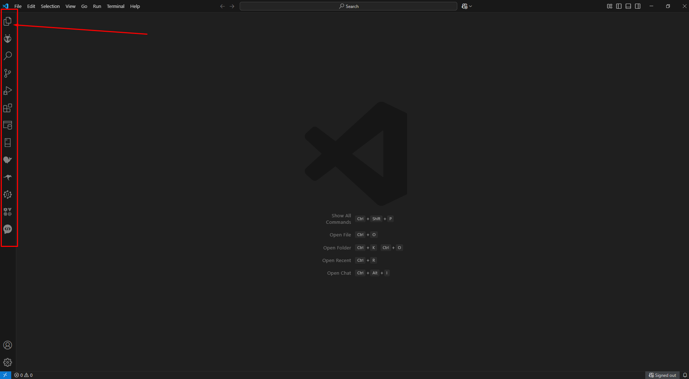
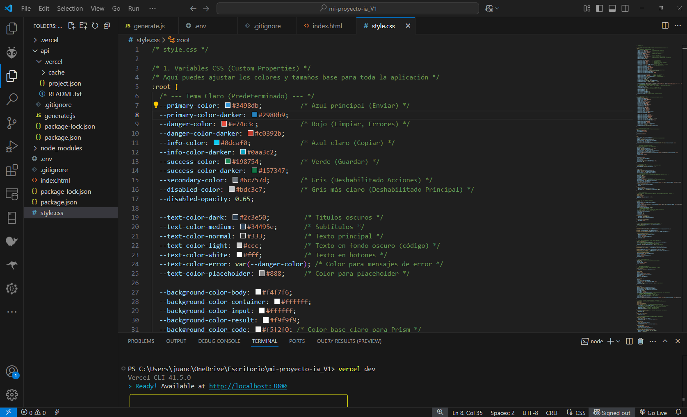

# 🚀 Simple Gemini AI Web App (Guía de Configuración Local)
## 🛠️ Creando una Interfaz Personalizada con la API de Google: Uso, Integración y Despliegue con HTML, CSS, JS : Local y en Vercel 😃🚀

Esta es una aplicación web básica que permite a los usuarios enviar consultas a la **API de Google Gemini** y ver las respuestas. Utiliza un frontend simple (HTML, CSS, JS) y un backend serverless (Node.js) que se ejecuta localmente simulando el entorno de Vercel con `vercel dev`.

## 📋 Prerrequisitos

Antes de comenzar, asegúrate de tener instalado lo siguiente:

1. **Node.js y npm:** Necesarios para ejecutar JavaScript en el backend, gestionar paquetes y usar Vercel CLI. Verifica tu instalación abriendo tu terminal y ejecutando:
   ```bash
   node -v
   npm -v
   ```
   Si no los tienes, descárgalos desde [nodejs.org](https://nodejs.org/) (se recomienda la versión LTS).

2. **Vercel CLI:** La herramienta de línea de comandos de Vercel. Instálala globalmente e inicia sesión:
   ```bash
   npm install -g vercel
   vercel login
   ```
   Sigue las instrucciones para autenticarte (generalmente a través del navegador).

3. **Google Gemini API Key:** Necesitas una clave API para usar Gemini. Puedes obtenerla desde [Google AI Studio](https://aistudio.google.com/) o la consola de Google Cloud. Asegúrate de que la API esté habilitada para tu proyecto.

4. **Un Editor de Código:** Como [Visual Studio Code](https://code.visualstudio.com/), Sublime Text, etc. En Nuestro Caso usaremos el VISUAL STUDIO CODE:


5. **Git (Opcional pero recomendado):** Si planeas usar GitHub.

## 🛠️ Herramientas Esenciales a Instalar

Instala estas herramientas iniciales y esenciales en tu computadora **ANTES** de empezar a crear los archivos del proyecto:

### 💻 PASO 1: Instalar Visual Studio Code (VS Code)

**¿Qué es?** Es el programa donde escribirás y editarás todo el código (HTML, CSS, JavaScript).

**¿Dónde conseguirlo?** Ve al sitio web oficial: https://code.visualstudio.com/

**Pasos de Instalación:**

1. Abre el enlace en tu navegador.
2. La página detectará automáticamente tu sistema operativo. Haz clic en el botón grande de descarga.
3. Se descargará un archivo instalador.
4. Ejecuta ese archivo.
5. En el asistente de instalación:
   - Acepta el acuerdo de licencia.
   - Elige la carpeta de instalación (la ubicación por defecto suele estar bien).
   - En "Tareas Adicionales", asegúrate de marcar "Agregar al PATH" (**importante**).
   - Haz clic en "Instalar".
6. ¡Listo! Ahora puedes buscar "Visual Studio Code" en tu menú de inicio y abrirlo.


## VISUAL STUDIO DESCARGAR E INSTALAR- VAMOS AL ENLACE:


## LE DAMOS A ESTA OPCION DE WINDOWS O EL SISTEMA QUE TENGAMOS:


## PANTALLA PRINCIPAL UNA VEZ HEMOS INSTALADO:




### ⚙️ PASO 2: Instalar Node.js y npm

**¿Qué es?** Node.js es el entorno que permite ejecutar JavaScript fuera del navegador. npm (Node Package Manager) viene incluido y se usa para instalar librerías.

**¿Dónde conseguirlo?** Ve al sitio web oficial: https://nodejs.org/

**Pasos de Instalación:**

1. Abre el enlace en tu navegador.
2. Elige la versión **LTS** (Long Term Support).
3. Ejecuta el archivo descargado.
4. En el asistente de instalación:
   - Acepta los términos de licencia.
   - Elige la carpeta de instalación.
   - Asegúrate de que la opción "Add to PATH" esté seleccionada (**crucial**).
   - Haz clic en "Instalar".
5. **Verificación Importante:**
   - Cierra TODOS los terminales abiertos.
   - Abre un NUEVO terminal.
   - Escribe `node -v` y presiona Enter.
   - Escribe `npm -v` y presiona Enter.
   - Si ves números de versión, ¡todo está correcto!
 
## NODE DESCARGAR E INSTALAR- VAMOS AL ENLACE:


## LE DAMOS A ESTA OPCION:


 
   

### 🔄 PASO 3: Instalar Vercel CLI

**¿Qué es?** Es la herramienta de línea de comandos de Vercel para ejecutar y desplegar tu proyecto.

**Pasos de Instalación:**

1. Abre un terminal.
2. Escribe el siguiente comando y presiona Enter:
   ```bash
   npm install -g vercel
   ```
3. Verifica la instalación:
   ```bash
   vercel --version
   ```
4. Iniciar Sesión:
   ```bash
   vercel login
   ```
5. Sigue las instrucciones para autorizar la conexión.

## 📁 Pasos de Configuración

Sigue estos pasos para configurar y ejecutar el proyecto en tu máquina local.

### 1. Crear la Carpeta del Proyecto

Crea una carpeta en tu computadora donde vivirá el proyecto. Abre tu terminal y usa:

```bash
# Elige una ubicación (ej. Escritorio)
cd ~/Desktop
# Crea la carpeta del proyecto
mkdir mi-proyecto-ia
# Entra en la carpeta
cd mi-proyecto-ia
```

### 2. Estructura de Archivos

Tu proyecto tendrá esta estructura:

```
mi-proyecto-ia/
├── api/
│   └── generate.js      <-- Archivo de la función serverless
├── .env                 <-- Archivo para la API Key (local)
├── .gitignore           <-- Archivo para ignorar archivos en Git/Vercel
├── index.html           <-- El frontend de la aplicación
├── style.css            <-- Estilos CSS para el frontend
└── package.json         <-- Se creará con npm init
```

Para crear esta estructura, dentro de la carpeta del proyecto ejecuta:

```bash
# Dentro de mi-proyecto-ia
mkdir api
touch index.html style.css .env .gitignore api/generate.js
```


# 📄 Código del Archivo `index.html`


# 📄 Código del Archivo `index.html`

```html
<!DOCTYPE html>
<html lang="es" data-theme="light"> <head>
  <meta charset="UTF-8">
  <link rel="shortcut icon" href="https://cdn-icons-png.flaticon.com/512/10306/10306029.png" type="image/x-icon">
  <meta name="viewport" content="width=device-width, initial-scale=1.0"> <title>Mi App con Gemini AI</title>
  <link href="https://cdnjs.cloudflare.com/ajax/libs/prism/1.29.0/themes/prism.min.css" rel="stylesheet" />
  <link rel="stylesheet" href="style.css"> </head>

<body>
  <div class="theme-toggle-container">
    <button id="themeToggle" title="Cambiar modo claro/oscuro">🌞</button>
  </div>

  <div class="container">
    <div style="text-align: center;">
      
  </div>
    <h1>🛠️ Creando una Interfaz Personalizada con la API de Google: Uso, Integración y Despliegue con HTML, CSS, JS : Local y en Vercel 😃🚀</h1>
    

    <div class="prompt-section">
      <textarea class="prompt-area" id="promptInput" placeholder="Escribe tu consulta aquí..."></textarea>
      <div class="button-group">
        <button id="executeBtn" title="Enviar consulta">
          <svg xmlns="http://www.w3.org/2000/svg" width="16" height="16" fill="currentColor" class="bi bi-send" viewBox="0 0 16 16">
            <path d="M15.854.146a.5.5 0 0 1 .11.54l-5.819 14.547a.75.75 0 0 1-1.329.124l-3.178-4.995L.643 7.184a.75.75 0 0 1 .124-1.33L15.314.037a.5.5 0 0 1 .54.11ZM6.636 10.07l2.761 4.338L14.13 2.576zm6.787-8.201L1.591 6.602l4.339 2.76z"/>
          </svg>
          Enviar
        </button>
        <button id="clearBtn" title="Limpiar consulta y resultado">
            <svg xmlns="http://www.w3.org/2000/svg" width="16" height="16" fill="currentColor" class="bi bi-eraser" viewBox="0 0 16 16">
              <path d="M8.086 2.207a2 2 0 0 1 2.828 0l3.879 3.879a2 2 0 0 1 0 2.828l-5.5 5.5A2 2 0 0 1 7.879 15H5.12a2 2 0 0 1-1.414-.586l-2.5-2.5a2 2 0 0 1 0-2.828zm2.121.707a1 1 0 0 0-1.414 0L4.16 7.547l5.293 5.293 4.633-4.633a1 1 0 0 0 0-1.414zM8.746 13.547 3.453 8.254 1.914 9.793a1 1 0 0 0 0 1.414l2.5 2.5a1 1 0 0 0 .707.293H7.88a1 1 0 0 0 .707-.293z"/>
            </svg>
          Limpiar
        </button>
      </div>
    </div>

    <div class="result-container">
      <div class="result-header">
          <h3>Respuesta de la IA:</h3>
          <div class="result-actions">
              <button id="copyBtn" title="Copiar al portapapeles" disabled>
                <svg xmlns="http://www.w3.org/2000/svg" width="16" height="16" fill="currentColor" class="bi bi-clipboard" viewBox="0 0 16 16">
                  <path d="M4 1.5H3a2 2 0 0 0-2 2V14a2 2 0 0 0 2 2h10a2 2 0 0 0 2-2V3.5a2 2 0 0 0-2-2h-1v1h1a1 1 0 0 1 1 1V14a1 1 0 0 1-1 1H3a1 1 0 0 1-1-1V3.5a1 1 0 0 1 1-1h1z"/>
                  <path d="M9.5 1a.5.5 0 0 1 .5.5v1a.5.5 0 0 1-.5.5h-3a.5.5 0 0 1-.5-.5v-1a.5.5 0 0 1 .5-.5zm-3-1A1.5 1.5 0 0 0 5 1.5v1A1.5 1.5 0 0 0 6.5 4h3A1.5 1.5 0 0 0 11 2.5v-1A1.5 1.5 0 0 0 9.5 0z"/>
                </svg>
                Copiar
              </button>
              <button id="saveBtn" title="Guardar como .txt" disabled>
                <svg xmlns="http://www.w3.org/2000/svg" width="16" height="16" fill="currentColor" class="bi bi-download" viewBox="0 0 16 16">
                  <path d="M.5 9.9a.5.5 0 0 1 .5.5v2.5a1 1 0 0 0 1 1h12a1 1 0 0 0 1-1v-2.5a.5.5 0 0 1 1 0v2.5a2 2 0 0 1-2 2H2a2 2 0 0 1-2-2v-2.5a.5.5 0 0 1 .5-.5"/>
                  <path d="M7.646 11.854a.5.5 0 0 0 .708 0l3-3a.5.5 0 0 0-.708-.708L8.5 10.293V1.5a.5.5 0 0 0-1 0v8.793L5.354 8.146a.5.5 0 1 0-.708.708z"/>
                </svg>
                Guardar
              </button>
          </div>
      </div>
      <div id="resultBox" class="result-box">Esperando consulta...</div>
    </div>
  </div>

  <div class="loading" id="loading" style="display: none;">
    <div class="spinner"></div>
    <span>Cargando...</span>
  </div>

  <script src="https://cdn.jsdelivr.net/npm/marked/marked.min.js"></script>
  <script src="https://cdnjs.cloudflare.com/ajax/libs/prism/1.29.0/components/prism-core.min.js"></script>
  <script src="https://cdnjs.cloudflare.com/ajax/libs/prism/1.29.0/plugins/autoloader/prism-autoloader.min.js"></script>
  <script>
    // Referencias a elementos del DOM
    const executeBtn = document.getElementById('executeBtn');
    const clearBtn = document.getElementById('clearBtn');
    const promptInput = document.getElementById('promptInput');
    const resultBox = document.getElementById('resultBox');
    const loadingIndicator = document.getElementById('loading');
    const copyBtn = document.getElementById('copyBtn');
    const saveBtn = document.getElementById('saveBtn');
    const themeToggleBtn = document.getElementById('themeToggle'); // Botón de tema

    // Estado inicial de los botones de acción
    copyBtn.disabled = true;
    saveBtn.disabled = true;

    // --- Funcionalidad del Tema ---
    const currentTheme = localStorage.getItem('theme') || 'light'; // Obtener tema guardado o usar 'light'
    document.documentElement.setAttribute('data-theme', currentTheme); // Aplicar tema al cargar
    themeToggleBtn.textContent = currentTheme === 'light' ? '🌞' : '🌜'; // Establecer icono inicial

    themeToggleBtn.addEventListener('click', () => {
      let targetTheme = document.documentElement.getAttribute('data-theme') === 'light' ? 'dark' : 'light';
      document.documentElement.setAttribute('data-theme', targetTheme);
      localStorage.setItem('theme', targetTheme); // Guardar preferencia
      themeToggleBtn.textContent = targetTheme === 'light' ? '🌞' : '🌜'; // Actualizar icono
      // Opcional: Si usas un tema específico de Prism para modo oscuro, cámbialo aquí
      // updatePrismTheme(targetTheme);
    });

    // Opcional: Función para cambiar el CSS de Prism si es necesario
    // function updatePrismTheme(theme) {
    //   const prismLink = document.querySelector('link[href*="prism"]');
    //   if (prismLink) {
    //     prismLink.href = theme === 'dark'
    //       ? 'https://cdnjs.cloudflare.com/ajax/libs/prism/1.29.0/themes/prism-tomorrow.min.css'
    //       : 'https://cdnjs.cloudflare.com/ajax/libs/prism/1.29.0/themes/prism.min.css';
    //   }
    // }
    // updatePrismTheme(currentTheme); // Llamar al cargar la página


    // --- Lógica Principal de la App (sin cambios) ---
    executeBtn.addEventListener('click', executeQuery);
    clearBtn.addEventListener('click', clearAll);
    copyBtn.addEventListener('click', copyToClipboard);
    saveBtn.addEventListener('click', saveAsTextFile);

    async function executeQuery() {
      const prompt = promptInput.value.trim();
      if (!prompt) {
        // Usar un modal o notificación más elegante en lugar de alert
        showNotification('Por favor, escribe una consulta.');
        return;
      }
      showLoading();
      resultBox.textContent = 'Procesando...';
      copyBtn.disabled = true;
      saveBtn.disabled = true;
      try {
        // IMPORTANTE: Asegúrate de que esta ruta '/api/generate' sea correcta
        // para tu backend o configuración de servidor.
        const response = await fetch('/api/generate', {
          method: 'POST',
          headers: { 'Content-Type': 'application/json' },
          body: JSON.stringify({ prompt: prompt }),
        });

        if (!response.ok) {
          let errorMsg = 'Error al comunicarse con el servidor.';
          try {
            const errorData = await response.json();
            errorMsg = `Error ${response.status}: ${errorData.error || 'Detalles no disponibles.'}`;
          } catch (e) {
            errorMsg = `Error ${response.status}: ${response.statusText}`;
          }
          throw new Error(errorMsg);
        }

        const data = await response.json();

        // Validación más robusta de la respuesta de la API Gemini
        if (data.candidates && data.candidates.length > 0 && data.candidates[0].content?.parts?.length > 0) {
          const contentPart = data.candidates[0].content.parts[0];
          if (contentPart.text) {
            displayResult(contentPart.text); // Pasar solo el texto
            copyBtn.disabled = false;
            saveBtn.disabled = false;
          } else {
             console.warn('La parte de contenido no contiene texto:', contentPart);
             resultBox.innerHTML = '<span class="error-message">La respuesta no contiene texto legible.</span>';
             copyBtn.disabled = true;
             saveBtn.disabled = true;
          }
        } else {
          console.warn('Respuesta inesperada o vacía de la API:', data);
          resultBox.innerHTML = '<span class="error-message">No se recibió una respuesta válida del modelo.</span>';
          copyBtn.disabled = true;
          saveBtn.disabled = true;
        }
      } catch (error) {
        console.error('Error en executeQuery:', error);
        // Mostrar error de forma más visible
        resultBox.innerHTML = `<span class="error-message">Error: ${error.message}</span>`;
        // Permitir copiar/guardar el mensaje de error
        copyBtn.disabled = false;
        saveBtn.disabled = false;
      } finally {
        hideLoading();
      }
    }

    function displayResult(text) {
        // Usar marked para convertir Markdown a HTML
        resultBox.innerHTML = marked.parse(text);
        // Resaltar sintaxis en los bloques de código generados
        Prism.highlightAllUnder(resultBox);
    }

    async function copyToClipboard() {
      const textToCopy = resultBox.innerText; // Usar innerText para obtener solo el texto visible
      if (!textToCopy || resultBox.textContent === 'Esperando consulta...' || resultBox.textContent === 'Procesando...') {
        showNotification('No hay resultado para copiar.');
        return;
       }
      try {
          await navigator.clipboard.writeText(textToCopy);
          const originalHTML = copyBtn.innerHTML; // Guardar el SVG y texto
          copyBtn.textContent = '¡Copiado!'; // Solo texto para simplicidad temporal
          copyBtn.disabled = true;
          setTimeout(() => {
            copyBtn.innerHTML = originalHTML; // Restaurar SVG y texto
            copyBtn.disabled = false;
          }, 1500);
      } catch (err) {
          console.error('Error al copiar:', err);
          showNotification('No se pudo copiar el texto.');
      }
    }

    function saveAsTextFile() {
        const textToSave = resultBox.innerText; // Usar innerText
        if (!textToSave || resultBox.textContent === 'Esperando consulta...' || resultBox.textContent === 'Procesando...') {
          showNotification('No hay resultado para guardar.');
          return;
        }
        try {
            const blob = new Blob([textToSave], { type: 'text/plain;charset=utf-8' });
            const url = URL.createObjectURL(blob);
            const anchor = document.createElement('a');
            anchor.href = url;
            // Nombre de archivo más descriptivo
            const timestamp = new Date().toISOString().slice(0, 10); // YYYY-MM-DD
            anchor.download = `gemini-respuesta-${timestamp}.txt`;
            document.body.appendChild(anchor); // Necesario para Firefox
            anchor.click();
            document.body.removeChild(anchor);
            URL.revokeObjectURL(url); // Liberar memoria
        } catch (error) {
            console.error('Error al guardar archivo:', error);
            showNotification('Ocurrió un error al intentar guardar el archivo.');
        }
    }

    function showLoading() {
      loadingIndicator.style.display = 'flex';
      executeBtn.disabled = true;
      clearBtn.disabled = true; // Deshabilitar limpiar mientras carga
    }

    function hideLoading() {
      loadingIndicator.style.display = 'none';
      executeBtn.disabled = false;
      clearBtn.disabled = false;
    }

    function clearAll() {
      promptInput.value = '';
      resultBox.innerHTML = 'Esperando consulta...'; // Restaurar mensaje inicial
      copyBtn.disabled = true;
      saveBtn.disabled = true;
    }

    // Función simple para mostrar notificaciones (reemplaza alert)
    function showNotification(message) {
        // Puedes implementar un sistema de notificaciones más sofisticado aquí
        // Por ahora, usaremos un simple alert como placeholder
        alert(message);
    }

  </script>
</body>
</html>

```

## 📋 Estructura del Documento

Este archivo HTML crea una interfaz de usuario simple para interactuar con la API de Google Gemini. Incluye:

### 🧩 Componentes Principales

1. **Contenedor Principal**
   - Título de la aplicación
   - Sección para ingresar prompts
   - Sección para mostrar resultados

2. **Sección de Prompt**
   - Campo de texto para escribir consultas
   - Botón "Enviar" con icono SVG
   - Botón "Limpiar" con icono SVG

3. **Sección de Resultados**
   - Encabezado que indica "Respuesta de la IA"
   - Botón "Copiar" para copiar resultados al portapapeles
   - Botón "Guardar" para descargar resultados como archivo de texto
   - Área donde se muestra la respuesta

4. **Indicador de Carga**
   - Animación spinner
   - Texto "Cargando..."

### 📚 Librerías Externas

- **Marked.js**: Para conversión de markdown a HTML
- **Prism.js**: Para resaltado de sintaxis en bloques de código

### 🔄 Funcionalidad JavaScript

- **executeQuery()**: Envía consultas a la API y procesa respuestas
- **displayResult()**: Muestra resultados formateados
- **copyToClipboard()**: Copia resultados al portapapeles
- **saveAsTextFile()**: Guarda resultados como archivo .txt
- **showLoading() / hideLoading()**: Controla la visibilidad del indicador de carga
- **clearAll()**: Limpia la consulta y los resultados


# CSS Styles Documentation

## 1. Variables CSS (Custom Properties)
## 2. Reset y Box-Sizing Global
## 3. Estilos del Contenedor Principal
## 4. Sección del Prompt
## 5. Grupos de Botones
## 6. Sección de Resultados
## 7. Loading Spinner
## 8. Media Queries para Responsividad


# Codigo Arvhivo CSS Hoja Styles.css



# Codigo Arvhivo CSS Hoja Styles.css

```css
/* style.css */

/* 1. Variables CSS (Custom Properties) */
/* Aquí puedes ajustar los colores y tamaños base para toda la aplicación */
:root {
  /* --- Tema Claro (Predeterminado) --- */
  --primary-color: #3498db;          /* Azul principal (Enviar) */
  --primary-color-darker: #2980b9;
  --danger-color: #e74c3c;           /* Rojo (Limpiar, Errores) */
  --danger-color-darker: #c0392b;
  --info-color: #0dcaf0;             /* Azul claro (Copiar) */
  --info-color-darker: #0aa3c2;
  --success-color: #198754;          /* Verde (Guardar) */
  --success-color-darker: #157347;
  --secondary-color: #6c757d;        /* Gris (Deshabilitado Acciones) */
  --disabled-color: #bdc3c7;         /* Gris más claro (Deshabilitado Principal) */
  --disabled-opacity: 0.65;

  --text-color-dark: #2c3e50;         /* Títulos oscuros */
  --text-color-medium: #34495e;       /* Subtítulos */
  --text-color-normal: #333;          /* Texto principal */
  --text-color-light: #ccc;           /* Texto en fondo oscuro (código) */
  --text-color-white: #fff;           /* Texto en botones */
  --text-color-error: var(--danger-color); /* Color para mensajes de error */
  --text-color-placeholder: #888;     /* Color para placeholder */

  --background-color-body: #f4f7f6;
  --background-color-container: #ffffff;
  --background-color-input: #ffffff;
  --background-color-result: #f9f9f9;
  --background-color-code: #f5f2f0; /* Color base claro para Prism */
  --background-color-overlay: rgba(255, 255, 255, 0.7);
  --background-color-button-toggle: #eee;
  --background-color-button-toggle-hover: #ddd;


  --border-color-light: #e0e0e0;       /* Borde caja resultado */
  --border-color-medium: #dcdcdc;      /* Borde textarea */
  --border-color-focus: var(--primary-color); /* Borde al enfocar */
  --border-radius-standard: 4px;
  --border-radius-large: 8px;

  --shadow-color: rgba(0, 0, 0, 0.1);
  --shadow-container: 0 4px 8px var(--shadow-color);
  --shadow-button-hover: 0 2px 5px rgba(0, 0, 0, 0.2);

  --font-family-sans: -apple-system, BlinkMacSystemFont, "Segoe UI", Roboto, Helvetica, Arial, sans-serif, "Apple Color Emoji", "Segoe UI Emoji", "Segoe UI Symbol";
  --font-family-mono: "SFMono-Regular", Consolas, "Liberation Mono", Menlo, Courier, monospace;
  /* --- AJUSTE GLOBAL: Tamaño de fuente base --- */
  /* Afecta a la mayoría de los textos si usan 'inherit' o 'var(--base-font-size)' */
  --base-font-size: 17px;
  --line-height-normal: 1.6; /* Altura de línea estándar */
  --spacing-unit: 8px; /* Unidad base para márgenes/paddings */

  --button-padding-y: 10px;
  --button-padding-x: 20px;
  --button-action-padding-y: 5px;
  --button-action-padding-x: 10px;

  --transition-speed: 0.2s; /* Velocidad de las animaciones */
}

/* --- Tema Oscuro --- */
/* Sobrescribe las variables de :root cuando el tema es oscuro */
[data-theme="dark"] {
  --primary-color: #5dade2;
  --primary-color-darker: #85c1e9;
  --danger-color: #f1948a;
  --danger-color-darker: #e6b0aa;
  --info-color: #76d7c4;
  --info-color-darker: #a3e4d7;
  --success-color: #7dcea0;
  --success-color-darker: #a9dfbf;
  --secondary-color: #99a3a4;
  --disabled-color: #7f8c8d;

  --text-color-dark: #ecf0f1;
  --text-color-medium: #bdc3c7;
  --text-color-normal: #e0e0e0;
  --text-color-light: #95a5a6;
  --text-color-white: #1c1c1c;
  --text-color-error: var(--danger-color);
  --text-color-placeholder: #777;

  --background-color-body: #2c3e50;
  --background-color-container: #34495e;
  --background-color-input: #465a70;
  --background-color-result: #405164;
  --background-color-code: #2d2d2d;
  --background-color-overlay: rgba(0, 0, 0, 0.6);
  --background-color-button-toggle: #444;
  --background-color-button-toggle-hover: #555;

  --border-color-light: #4a637d;
  --border-color-medium: #56708a;
  --border-color-focus: var(--primary-color);

  --shadow-color: rgba(0, 0, 0, 0.3);
  --shadow-container: 0 4px 12px var(--shadow-color);
}

/* 2. Reset y Box-Sizing Global */
/* Configuraciones generales para asegurar consistencia */
html {
  box-sizing: border-box;
  scroll-behavior: smooth;
}
*, *:before, *:after {
  box-sizing: inherit;
}

body {
  font-family: var(--font-family-sans);
  font-size: var(--base-font-size); /* Tamaño base aplicado al body */
  margin: 0;
  padding: calc(var(--spacing-unit) * 2.5);
  background-color: var(--background-color-body);
  color: var(--text-color-normal);
  line-height: var(--line-height-normal); /* Altura de línea base */
  transition: background-color var(--transition-speed) ease, color var(--transition-speed) ease;
}

/* 3. Estilos del Contenedor Principal */
/* El contenedor que envuelve toda la aplicación */
.container {
  max-width: 1200px;
  margin: calc(var(--spacing-unit) * 2.5) auto;
  padding: calc(var(--spacing-unit) * 3);
  background-color: var(--background-color-container);
  border-radius: var(--border-radius-large);
  box-shadow: var(--shadow-container);
  transition: background-color var(--transition-speed) ease, box-shadow var(--transition-speed) ease;
  display: flex;
  flex-direction: column;
}

h1 {
  text-align: center;
  color: var(--text-color-dark);
  margin-top: 0;
  margin-bottom: calc(var(--spacing-unit) * 4);
  transition: color var(--transition-speed) ease;
  font-weight: 600;
}

/* 4. Sección del Prompt */
/* Estilos para el área de texto donde el usuario escribe */
.prompt-section {
  margin-bottom: calc(var(--spacing-unit) * 3);
}

.prompt-area {
  width: 100%;
  padding: calc(var(--spacing-unit) * 1.5);
  border: 1px solid var(--border-color-medium);
  border-radius: var(--border-radius-standard);
  /* --- TAMAÑO FUENTE PROMPT --- */
  /* Hereda el tamaño de fuente del body (var(--base-font-size)) */
  /* Puedes cambiarlo aquí si quieres un tamaño diferente: font-size: 18px; */
  font-size: 20px;
  text-align: justify;
  min-height: 100px;
  resize: vertical;
  margin-bottom: calc(var(--spacing-unit) * 1.5);
  font-family: inherit; /* Usa la misma fuente sans-serif del body */
  background-color: var(--background-color-input);
  color: var(--text-color-normal);
  transition: background-color var(--transition-speed) ease, color var(--transition-speed) ease, border-color var(--transition-speed) ease;
}
.prompt-area::placeholder {
    color: var(--text-color-placeholder);
    opacity: 0.8;
}
.prompt-area:focus {
    outline: none;
    border-color: var(--border-color-focus);
    box-shadow: 0 0 0 2px rgba(var(--primary-color), 0.2);
}


/* 5. Grupos de Botones */
/* Estilos para los botones principales (Enviar, Limpiar) y de acción (Copiar, Guardar) */
.button-group,
.result-actions {
  display: flex;
  gap: calc(var(--spacing-unit) * 1.5);
  flex-wrap: wrap;
}

/* Estilo base para TODOS los botones */
button {
  border: none;
  border-radius: var(--border-radius-standard);
  cursor: pointer;
  transition: background-color var(--transition-speed) ease, opacity var(--transition-speed) ease, transform var(--transition-speed) ease, box-shadow var(--transition-speed) ease;
  display: inline-flex;
  align-items: center;
  justify-content: center;
  gap: calc(var(--spacing-unit) * 0.75);
  /* --- TAMAÑO FUENTE BOTONES --- */
  /* Hereda el tamaño de fuente del body (var(--base-font-size)) */
  /* Puedes ajustarlo aquí: font-size: 16px; */
  font-size: inherit;
  color: var(--text-color-white);
  line-height: 1.2;
  font-weight: 500;
  text-align: center;
}
button:hover:not(:disabled) {
    transform: translateY(-1px);
    box-shadow: var(--shadow-button-hover);
}
button:active:not(:disabled) {
    transform: translateY(0px);
    box-shadow: none;
}

/* Estilo específico botones principales (Enviar, Limpiar) */
.button-group button {
  padding: var(--button-padding-y) var(--button-padding-x);
  /* Hereda font-size */
}

#executeBtn { background-color: var(--primary-color); }
#executeBtn:hover:not(:disabled) { background-color: var(--primary-color-darker); }

#clearBtn { background-color: var(--danger-color); }
#clearBtn:hover:not(:disabled) { background-color: var(--danger-color-darker); }

/* Deshabilitado para botones principales */
.button-group button:disabled {
    background-color: var(--disabled-color);
    cursor: not-allowed;
    opacity: var(--disabled-opacity);
    transform: none;
    box-shadow: none;
}

/* Estilo específico botones de acción (Copiar, Guardar) */
.result-actions button {
  padding: var(--button-action-padding-y) var(--button-action-padding-x);
  /* --- TAMAÑO FUENTE BOTONES ACCIÓN --- */
  /* Un poco más pequeño que los botones principales */
  font-size: calc(var(--base-font-size) - 2px); /* 15px ahora */
}

#copyBtn { background-color: var(--info-color); font-size: 20px; }
#copyBtn:hover:not(:disabled) { background-color: var(--info-color-darker); }

#saveBtn { background-color: var(--success-color); font-size: 20px;}
#saveBtn:hover:not(:disabled) { background-color: var(--success-color-darker); }

/* Deshabilitado para botones de acción */
.result-actions button:disabled {
  background-color: var(--secondary-color);
  cursor: not-allowed;
  opacity: var(--disabled-opacity);
  transform: none;
  box-shadow: none;
}

/* Iconos SVG dentro de botones */
button svg {
  width: 1em; /* Tamaño relativo al font-size del botón */
  height: 1em;
  vertical-align: middle;
  fill: currentColor;
}


/* 6. Sección de Resultados */
/* Estilos para el contenedor de la respuesta de la IA */
.result-container {
    margin-top: calc(var(--spacing-unit) * 4);
}

.result-header {
  display: flex;
  justify-content: space-between;
  align-items: center;
  margin-bottom: var(--spacing-unit);
  flex-wrap: wrap;
  gap: var(--spacing-unit);
}

.result-header h3 {
  margin: 0;
  color: var(--text-color-medium);
  transition: color var(--transition-speed) ease;
  flex-grow: 1;
  font-size: calc(var(--base-font-size) + 2px); /* 19px ahora */
  font-weight: 600;
}

.result-box {
  padding: calc(var(--spacing-unit) * 2);
  border: 1px solid var(--border-color-light);
  border-radius: var(--border-radius-standard);
  background-color: var(--background-color-result);
  min-height: 150px;
  white-space: pre-wrap;
  word-wrap: break-word;
  font-family: var(--font-family-mono); /* Fuente monoespaciada para resultados */
  /* --- AJUSTE: TAMAÑO FUENTE RESULTADOS --- */
  /* Aumentado para que coincida con el tamaño base */
  font-size: var(--base-font-size); /* 17px ahora */
  overflow-x: auto;
  color: var(--text-color-normal);
  transition: background-color var(--transition-speed) ease, color var(--transition-speed) ease, border-color var(--transition-speed) ease;
}

/* --- AJUSTE: ESPACIADO ENTRE ELEMENTOS EN RESULTADOS --- */
/* Controla el espacio vertical (altura) entre párrafos, listas, etc. */
.result-box p,
.result-box li,
.result-box blockquote,
.result-box pre /* Incluir <pre> para espaciado consistente */ {
    line-height: var(--line-height-normal); /* Altura de línea estándar (1.6) */
    /* --- AJUSTE: Reducir márgenes verticales --- */
    /* Cambia estos valores (ej. 0.2em, 0.4em) para más/menos espacio */
    margin-top: 0.3em;    /* Espacio reducido arriba */
    margin-bottom: 0.3em; /* Espacio reducido abajo */
}
/* Eliminar margen extra al inicio y final del contenedor de resultados */
.result-box > *:first-child {
    margin-top: 0;
}
.result-box > *:last-child {
    margin-bottom: 0;
}

/* Estilos para elementos específicos dentro de los resultados */
.result-box strong {
    color: var(--text-color-dark);
    transition: color var(--transition-speed) ease;
    font-weight: 600;
}
.result-box a {
    color: var(--primary-color);
    text-decoration: none;
    transition: color var(--transition-speed) ease;
}
.result-box a:hover {
    text-decoration: underline;
    color: var(--primary-color-darker);
}
/* Código inline (ej: `variable`) */
.result-box code:not([class*="language-"]) {
    background-color: rgba(127, 140, 141, 0.15);
    padding: 0.2em 0.4em;
    border-radius: 3px;
    font-size: 90%; /* Un poco más pequeño que el texto circundante */
}
[data-theme="dark"] .result-box code:not([class*="language-"]) {
    background-color: rgba(44, 62, 80, 0.5);
}

/* Estilos para bloques de código resaltados por PrismJS */
/* El margen vertical se controla ahora por la regla general de arriba */
pre[class*="language-"] {
  padding: 1em;
  overflow: auto;
  border-radius: var(--border-radius-standard);
  background: var(--background-color-code);
  border: 1px solid var(--border-color-light);
  transition: background-color var(--transition-speed) ease, border-color var(--transition-speed) ease;
}
/* Texto dentro de los bloques de código */
pre[class*="language-"] code {
    color: #333; /* Color base para tema claro */
    font-family: var(--font-family-mono);
    font-size: 0.95em; /* Ligeramente más pequeño que el texto de resultados */
    line-height: 1.5; /* Altura de línea específica para código */
    background: none;
    text-shadow: none;
    white-space: pre; /* Mantiene los espacios y saltos de línea */
}
[data-theme="dark"] pre[class*="language-"] code {
    color: #ccc; /* Color base para tema oscuro */
}
/* Colores específicos para tokens de Prism en modo oscuro (ajustar si es necesario) */
[data-theme="dark"] .token.comment,
[data-theme="dark"] .token.prolog,
[data-theme="dark"] .token.doctype,
[data-theme="dark"] .token.cdata {
	color: #999;
}
[data-theme="dark"] .token.punctuation {
	color: #ccc;
}
/* ... (añadir más overrides de tokens si el tema por defecto no contrasta bien) ... */


/* 7. Loading Spinner */
/* El indicador de carga que aparece durante la llamada a la API */
.loading {
  position: fixed;
  top: 0;
  left: 0;
  width: 100%;
  height: 100%;
  background-color: var(--background-color-overlay);
  display: none; /* Se muestra con JS */
  justify-content: center;
  align-items: center;
  z-index: 1000;
  flex-direction: column;
  gap: var(--spacing-unit);
  color: var(--text-color-normal);
  font-size: 1.1em;
  transition: background-color var(--transition-speed) ease, color var(--transition-speed) ease;
}

.spinner {
  border: 4px solid rgba(127, 140, 141, 0.3);
  border-top: 4px solid var(--primary-color); /* Usa el color primario del tema */
  border-radius: 50%;
  width: 40px;
  height: 40px;
  animation: spin 1s linear infinite;
  transition: border-top-color var(--transition-speed) ease;
}

@keyframes spin {
  0% { transform: rotate(0deg); }
  100% { transform: rotate(360deg); }
}

/* Mensaje de error en el resultado */
.error-message {
    color: var(--text-color-error);
    font-weight: bold;
}

/* 8. Botón de cambio de tema */
/* El botón con el sol/luna */
.theme-toggle-container {
    position: absolute;
    top: calc(var(--spacing-unit) * 1.5);
    right: calc(var(--spacing-unit) * 1.5);
    z-index: 10;
}

#themeToggle {
    background-color: var(--background-color-button-toggle);
    color: var(--text-color-normal);
    border: 1px solid var(--border-color-medium);
    border-radius: 50%;
    width: 40px;
    height: 40px;
    font-size: 1.5em; /* Tamaño del emoji */
    padding: 0;
    display: flex;
    align-items: center;
    justify-content: center;
    box-shadow: 0 1px 3px rgba(0,0,0,0.1);
    transition: background-color var(--transition-speed) ease, color var(--transition-speed) ease, border-color var(--transition-speed) ease, transform var(--transition-speed) ease;
}

#themeToggle:hover {
    background-color: var(--background-color-button-toggle-hover);
    transform: scale(1.1); /* Efecto visual al pasar el ratón */
}


/* 9. Media Queries para Responsividad */
/* Ajustes para diferentes tamaños de pantalla */
@media (max-width: 768px) {
  body {
    padding: var(--spacing-unit);
    /* Opcional: Reducir tamaño base en móvil si 17px es muy grande */
    /* --base-font-size: 16px; */
  }

  .container {
    padding: calc(var(--spacing-unit) * 2);
    margin: var(--spacing-unit) auto;
  }

  h1 {
      font-size: 1.6em; /* Relativo a base-font-size */
      margin-bottom: calc(var(--spacing-unit) * 3);
  }

  .prompt-area {
      min-height: 100px;
  }

  .button-group {
    flex-direction: column; /* Apilar botones */
    align-items: stretch;
    gap: var(--spacing-unit);
  }
  .button-group button {
      width: 100%; /* Ocupar ancho completo */
  }

  .result-header {
    flex-direction: column;
    align-items: flex-start;
  }

  .result-actions {
      width: 100%;
      justify-content: flex-start;
      gap: var(--spacing-unit);
  }
   .result-actions button {
       flex-grow: 1; /* Distribuir espacio */
       text-align: center;
   }

  .result-box {
      /* --- TAMAÑO FUENTE RESULTADOS (MÓVIL) --- */
      font-size: calc(var(--base-font-size) - 1px); /* 16px ahora (un poco más pequeño en móvil) */
  }

  .theme-toggle-container {
      top: var(--spacing-unit);
      right: var(--spacing-unit);
  }
  #themeToggle {
      width: 36px;
      height: 36px;
      font-size: 1.3em;
  }
}

@media (max-width: 480px) {
    h1 {
        font-size: 1.4em; /* Relativo a base-font-size */
    }
    .button-group button,
    .result-actions button {
        padding: calc(var(--button-padding-y) * 0.8) calc(var(--button-padding-x) * 0.8);
        font-size: calc(var(--base-font-size) - 1px); /* 16px ahora */
    }
     .result-actions button {
         font-size: calc(var(--base-font-size) - 3px); /* 14px ahora */
     }
    .result-box {
        /* --- TAMAÑO FUENTE RESULTADOS (MÓVIL PEQUEÑO) --- */
        font-size: calc(var(--base-font-size) - 2px); /* 15px ahora */
    }
}

```


# Project Documentation


## API Implementation (api/generate.js)

```javascript
// api/generate.js
// Carga las variables de entorno del archivo .env (solo para desarrollo local)
require('dotenv').config();

const axios = require('axios');

// Middleware simple para CORS (permitir peticiones desde el navegador)
const allowCors = (fn) => async (req, res) => {
  res.setHeader('Access-Control-Allow-Credentials', true);
  res.setHeader('Access-Control-Allow-Origin', '*'); // Permite cualquier origen (para desarrollo)
  // O especifica tu origen local: res.setHeader('Access-Control-Allow-Origin', 'http://localhost:3000');
  res.setHeader('Access-Control-Allow-Methods', 'POST, OPTIONS');
  res.setHeader('Access-Control-Allow-Headers', 'X-CSRF-Token, X-Requested-With, Accept, Accept-Version, Content-Length, Content-MD5, Content-Type, Date, X-Api-Version');

  // Manejar petición OPTIONS (preflight)
  if (req.method === 'OPTIONS') {
    res.status(200).end();
    return;
  }
  // Ejecutar la función principal
  return await fn(req, res);
};

// La función principal que maneja la petición
const handler = async (req, res) => {
  // 1. Verificar que sea método POST
  if (req.method !== 'POST') {
    res.setHeader('Allow', ['POST']);
    return res.status(405).json({ error: 'Método no permitido' });
  }

  // 2. Obtener el prompt del cuerpo de la petición
  const { prompt } = req.body;

  if (!prompt) {
    return res.status(400).json({ error: 'El campo "prompt" es requerido.' });
  }

  // 3. Obtener la API Key de las variables de entorno
  const apiKey = process.env.GOOGLE_API_KEY;

  if (!apiKey) {
    console.error('Error: GOOGLE_API_KEY no está configurada.');
    // No reveles detalles de la API Key al cliente
    return res.status(500).json({ error: 'Error de configuración del servidor.' });
  }

  // 4. Definir la URL de la API de Google Gemini
  // Usa un modelo reciente como 'gemini-1.5-flash-latest'
  const apiUrl = `https://generativelanguage.googleapis.com/v1beta/models/gemini-1.5-flash-latest:generateContent?key=${apiKey}`;

  try {
    // 5. Realizar la llamada a la API de Google
    const response = await axios.post(apiUrl, {
      // El cuerpo esperado por la API de Gemini
      contents: [{
        parts: [{ text: prompt }]
      }],
      // Opcional: Configuración de generación (ej. para controlar la salida)
      // generationConfig: {
      //   temperature: 0.7,
      //   maxOutputTokens: 2048,
      // }
    }, {
      headers: {
        'Content-Type': 'application/json',
      }
    });

    // 6. Enviar la respuesta de Google de vuelta al frontend
    return res.status(200).json(response.data);

  } catch (error) {
    // 7. Manejar errores de la llamada a la API
    console.error('Error al llamar a la API de Google:', error.response ? error.response.data : error.message);

    // Construir un mensaje de error útil para el frontend
    const statusCode = error.response?.status || 500;
    const errorMessage = error.response?.data?.error?.message || 'Error interno al procesar la consulta con la IA.';

    return res.status(statusCode).json({ error: errorMessage });
  }
};

// Exportar el handler envuelto en el middleware CORS
module.exports = allowCors(handler);
```

## .gitignore Configuration: Aqui en este archivo vas a Poner los Arvhivos que deben subirse al Github o Vercel.


```
# Dependencias de Node.js
node_modules

# Archivo de variables de entorno local (¡MUY IMPORTANTE!)
.env

# Archivos de sistema operativo
.DS_Store
Thumbs.db

# Logs
npm-debug.log*
yarn-debug.log*
yarn-error.log*
*.log

# Archivos de configuración de Vercel local
.vercel
```

## Environment Variables (.env): Copia esta Linea de Codigo en el archivo .env: Aqui va la Clave APiKey que te Dio Google AI Studio. (No Puede ser Publica)

```
# Pega tu clave API de Google aquí SIN comillas ni espacios extra
GOOGLE_API_KEY=AIzaSyXXXXXXXXXXXXXXXXXXXXXXXXXXXXXXXXXXX
```

## Project Setup Instructions

### Inicializar npm e Instalar Dependencias: SIgue estos Pasos: En Visual Studio:

#### Abre tu terminal en Visual Studio dentro de la carpeta mi-proyecto-ia y ejecuta los siguientes comandos:

```bash

# 1. Inicializa npm (crea package.json)
# La opción -y acepta todas las configuraciones por defecto

npm init -y

# 2. Instala las dependencias necesarias (axios, cors, dotenv)

npm install axios cors dotenv


```

### Ejecutar el Proyecto Localmente: EN la misma Terminal:

##### Ahora estás listo para probar la aplicación en tu computadora.

1. **Iniciar el Servidor de Desarrollo Vercel**

   En tu terminal (aún dentro de la carpeta mi-proyecto-ia), ejecuta: Vercel dev

   ```bash
   
   vercel dev
   
   ```

2. **Responder a las Preguntas de Configuración (Solo la Primera Vez)**

   ##### Si es la primera vez que ejecutas vercel dev en esta carpeta, Vercel CLI necesita asociarla con tu cuenta y un proyecto (incluso para desarrollo local). Te hará algunas preguntas:

   - `? Set up and deploy "[ruta/a/tu/carpeta]"?` -> Responde con la Letra (Y) (o presiona Enter).
   - `? Which scope should contain your project?` -> Selecciona tu scope personal (tu nombre de usuario) o Simplemente presiona Enter.
   - `? Link to existing project?` -> Responde con la Letra (N) (o presiona Enter), ya que es nuevo para Vercel.
   - `? What's your project's name?` -> Presiona Enter: Si quieres Cambiar el Nombre del Proyecto Escribe un nombre válido, todo en minúsculas (ej. mi-proyecto-ia) y presiona Enter.
   - `? In which directory is your code located?` -> Presiona Enter.
   - (Si aparece) `? Want to modify these settings?` -> Responde N (o presiona Enter).

   Después de responder, Vercel guardará esta configuración en una carpeta oculta .vercel y no volverá a preguntar en futuras ejecuciones de vercel dev en esta carpeta.

3. **Acceder a la Aplicación**

   Una vez que vercel dev termine de iniciarse, verás un mensaje como:

   ```
   > Ready! Available at http://localhost:3000
   ```

   (El puerto podría ser 3001 o similar si el 3000 está ocupado).

   Abre tu navegador web y ve a la dirección indicada (ej. http://localhost:3000).

4. **Probar la Aplicación**

   - Deberías ver la interfaz web "Interactúa con Gemini".
   - Escribe una consulta en el área de texto.
   - Haz clic en "Enviar".
   - Verás el indicador "Cargando..." y, si todo es correcto, la respuesta de Gemini aparecerá en la caja de resultados.

## Captura:


5. **Detener el Servidor Local**

   Cuando termines de probar, vuelve al terminal donde se ejecuta vercel dev y presiona Ctrl + C. Confirma si te lo pide (S o Y).

## Despliegue en Vercel (Opcional)

Si deseas desplegar tu aplicación en la web:

1. Ejecuta el comando de despliegue:
   ```bash
   vercel deploy --prod
   ```

2. Configura la API Key en Vercel:
   - Ve al dashboard de tu proyecto en Vercel -> Settings -> Environment Variables

## Captura:


     
   - Añade una variable llamada GOOGLE_API_KEY con tu clave API como valor
   - Asegúrate de que esté disponible para Production, Preview y Development

3. Despliega: Desde tu terminal en la carpeta del proyecto, ejecuta el comando de despliegue nuevamente si es necesario.

  ## Ahora Solo debe probar en tu pc o movil. 

  # 🚀 Bienvenidos al Proyecto

Los invito a entrar al **repo**, donde encontrarán la guía completa para implementar la API de Google en una interfaz personalizada. Síganla paso a paso y exploren todas sus posibilidades.

💬 No duden en dejar cualquier comentario en redes sociales, ¡me encanta conocer sus opiniones y mejoras!  
📢 Si les gustó el contenido, síganme para más guías y tutoriales sobre desarrollo y tecnología.  
🌍 Compártanlo con su comunidad para que llegue a más personas apasionadas por la innovación.  
⭐ Y no olviden dejarle una **estrellita en GitHub**, eso ayuda muchísimo a seguir creando contenido útil para todos.  

Nos vemos en el próximo proyecto. ¡A programar se ha dicho! 😃🔥  

---

## 📡 ¡Apoya el contenido!

No olvides **suscribirte**, darle **like** y **compartir** este video para ayudarnos a seguir creando contenido como este. ¡Vamos a comenzar! 😊📡  

#RedesCisco #ProyectoDeRedes #CiscoPacketTracer 🌐💻📡  

---

## 📢 Sígueme en Redes Sociales  

1. 🎬 **YouTube**: [@JuancitoPenaV](https://www.youtube.com/channel/UCSob-3E5z4IHtMF5B4bN-FA)  
2. 👨‍💼 **LinkedIn**: [Juancito Peña](https://www.linkedin.com/in/juancitope%C3%B1a/)  
3. 📰 **Blog**: [Adviser Tecnology](https://advisertecnology.com/)  
4. 📷 **Instagram**: [@juancito.pena.v](https://www.instagram.com/juancito.pena.v/)  
5. 📑 **Facebook**: [Juancito Peña V](https://www.facebook.com/juancito.p.v)  
6. 🐦 **Twitter**: [@JuancitoPenaV](https://twitter.com/JuancitoPenaV)  
7. 📰 **Blog**: [Adviser Tecnology](https://advisertecnology.com/)  
